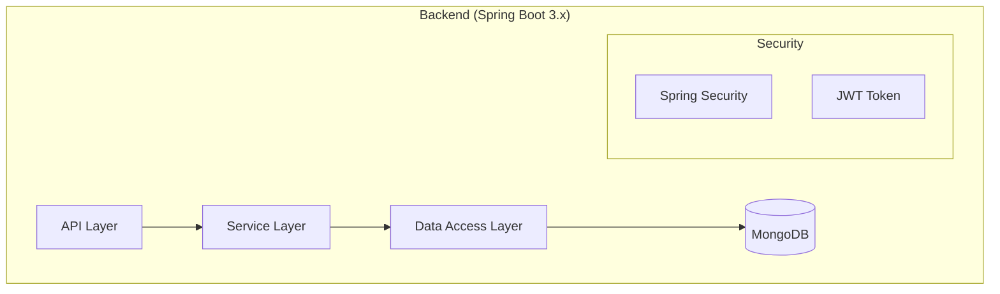
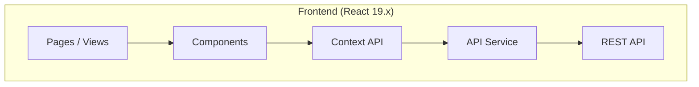
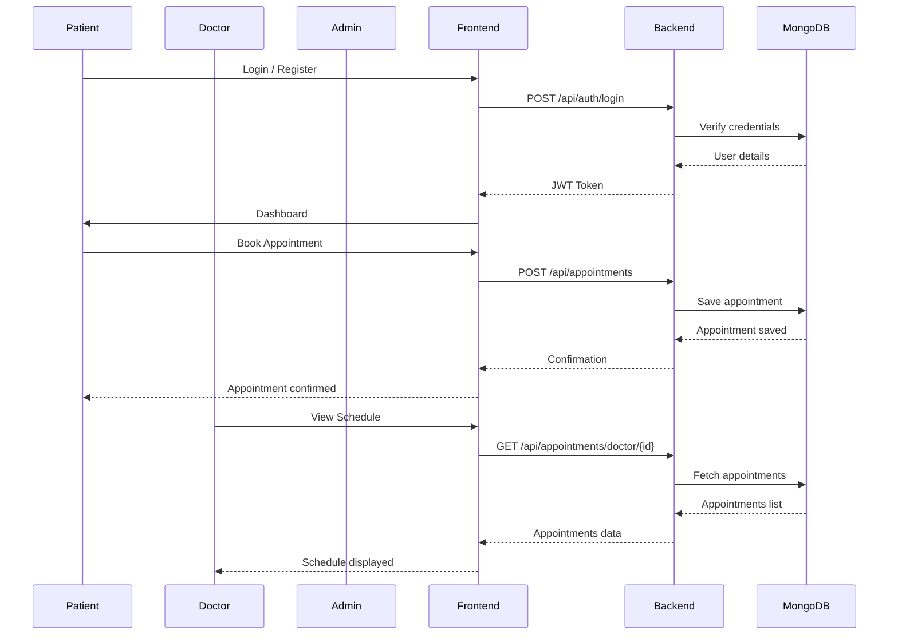
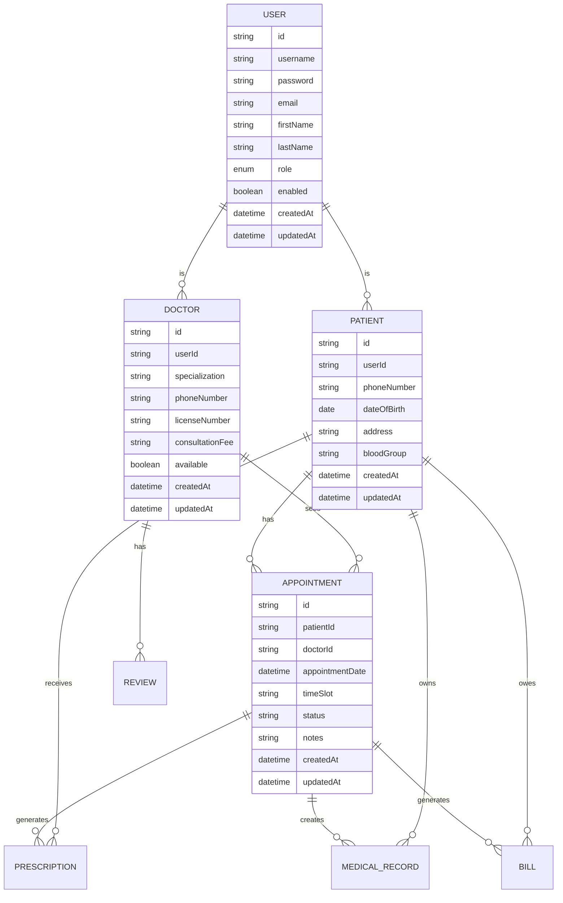

# 🏥 OPDHeal - Outpatient Department Management System

<div align="center">


*A modern, full-stack solution for digitalizing hospital outpatient department workflows*

</div>

---

## 📋 Overview

**OPDHeal** is a comprehensive hospital management platform designed to streamline outpatient department operations. The system provides role-based portals for patients, doctors, and administrative staff, enabling efficient management of appointments, medical records, prescriptions, billing, and analytics—all in a secure, user-friendly environment.

### 🎯 Key Highlights

- **Multi-tenant Architecture**: Separate, secure portals for patients, doctors, and administrators
- **Real-time Operations**: Live appointment scheduling
- **Digital Healthcare**: End-to-end paperless workflow from booking to billing
- **Analytics-Driven**: Comprehensive reporting and insights dashboard

---

## ✨ Features

### 👤 Patient Portal

| Feature | Description |
|---------|-------------|
| **Smart Appointment Booking** | Book appointments with real-time doctor availability |
| **Digital Health Records** | Centralized access to prescriptions and medical records |
| **Billing & Payments** | View invoices and payment history |
| **Prescription Management** | Access and download digital prescriptions |

### 👨‍⚕️ Doctor Portal

| Feature | Description |
|---------|-------------|
| **Unified Dashboard** | Daily schedule overview with patient queue |
| **E-Prescription System** | Digital prescription creation |
| **Patient EMR Access** | Complete electronic medical records |

### 🏢 Admin Portal

| Feature | Description |
|---------|-------------|
| **User Management** | Role-based access control |
| **Appointment Oversight** | System-wide appointment management |
| **Financial Dashboard** | Billing and payment tracking |

---

## 🛠️ Technology Stack

### Backend Architecture


**Key Dependencies**:
- **Security**: JWT token-based authentication, BCrypt password encryption
- **Database**: Spring Data MongoDB
- **API Docs**: SpringDoc OpenAPI (Swagger UI)
- **Build**: Maven

### Frontend Architecture


**Key Features**:
- Responsive design with Tailwind CSS
- React Router v7 for routing
- TypeScript support
- Vite as build tool

---

## 🚀 Getting Started

### Prerequisites

- **Java**: JDK 21
- **Node.js**: v18+ and npm
- **MongoDB**: MongoDB Atlas or local instance
- **Maven**: 3.8+

### Installation

#### 1️⃣ Clone the Repository
```bash
git clone <your-repository-url>
cd opdheal
```

#### 2️⃣ Backend Setup
```bash
cd server

# Configure database connection
cp src/main/resources/application.properties.example src/main/resources/application.properties
# Edit application.properties with your MongoDB credentials

# Build and run
mvn clean install
mvn spring-boot:run
```

Backend will start on `http://localhost:8080`

#### 3️⃣ Frontend Setup
```bash
cd client

# Install dependencies
npm install

# Configure API endpoint
cp .env.example .env
# Edit .env with backend URL (default: http://localhost:8080)

# Start development server
npm run dev
```

Frontend will start on `http://localhost:5173`

---

## 🏗️ System Architecture



### Entity Relationship Diagram


---

## 📚 API Documentation

Once the backend is running, access interactive API documentation at:

- **Swagger UI**: `http://localhost:8080/swagger-ui/index.html`
- **OpenAPI Spec**: `http://localhost:8080/v3/api-docs`

---

## 🔒 Security Features

- **JWT Authentication**: Stateless token-based authentication
- **Role-Based Access Control (RBAC): Granular permissions for PATIENT, DOCTOR, ADMIN roles
- **Password Security**: BCrypt hashing
- **CORS Configuration**: Restricted cross-origin requests
- **Input Validation**: Spring Validation for request payloads

---

## 📝 Project Structure

```
opdheal/
├── client/                 # React + TypeScript frontend
│   ├── src/
│   │   ├── components/     # Reusable UI components
│   │   ├── pages/          # Page components
│   │   ├── services/       # API service layer
│   │   ├── types/          # TypeScript type definitions
│   │   └── utils/          # Utility functions
│   └── package.json
├── server/                 # Spring Boot backend
│   ├── src/
│   │   ├── main/java/
│   │   │   └── com/mahesh/opdheal/
│   │   │       ├── config/      # Configuration classes
│   │   │       ├── controller/  # REST controllers
│   │   │       ├── dto/         # Data Transfer Objects
│   │   │       ├── exception/   # Exception handling
│   │   │       ├── model/       # MongoDB entities
│   │   │       ├── repository/  # Data repositories
│   │   │       ├── security/    # Security utilities
│   │   │       ├── service/     # Business logic
│   │   │       └── util/        # Helper utilities
│   │   └── main/resources/
│   └── pom.xml
└── README.md
```

---

## 📧 Contact

For any queries or suggestions, feel free to reach out!
